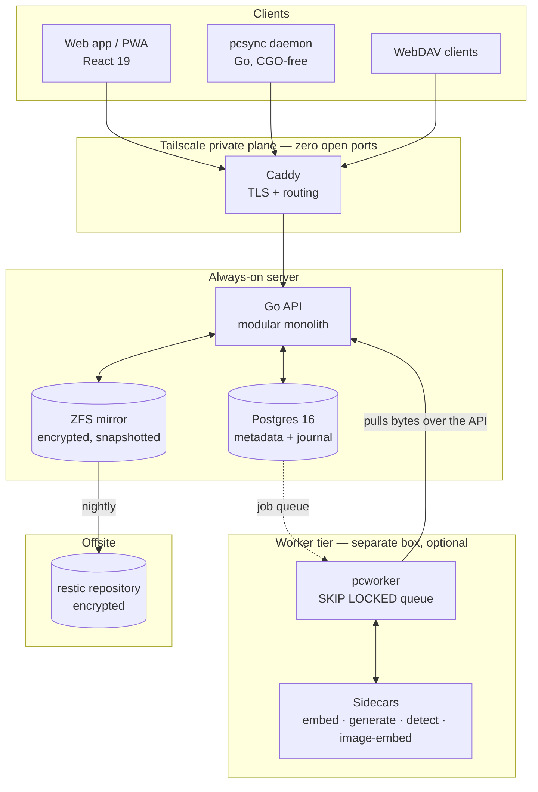
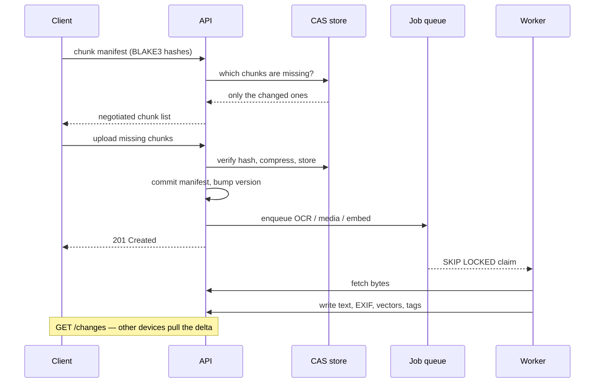

# Private Cloud

**A self-hosted, Dropbox-style personal cloud that runs on one Ubuntu server — and never phones home.**

[](.github/workflows/ci.yml)
[](server/go.mod)
[](web/package.json)
[](deploy/compose/docker-compose.yml)
[](scripts/zfs-setup.sh)
[](LICENSE)

Files, photos, search and sync — the things you would otherwise rent — running on
hardware you own, reachable only from devices you have authorised. No forwarded
router ports, no third-party storage, and no content that leaves your
infrastructure, including the machine-learning tier.

---

## Contents

| Section | |
|---|---|
| [What it does](#what-it-does) | The feature surface, by area |
| [Architecture](#architecture) | How the pieces fit |
| [How a file travels](#how-a-file-travels) | Upload, dedup, index, sync |
| [Quick start](#quick-start) | Six steps to a running stack |
| [Project status](#project-status) | Every phase, and the three open items |
| [Design decisions](#design-decisions) | The tradeoffs, and why |
| [Repository layout](#repository-layout) | Where things live |
| [Documentation](#documentation) | Which file answers which question |
| [Team](#team) | Who built it |

---

## What it does

| Area | Capabilities |
|---|---|
| **Files** | Upload/download, resumable transfers, WebDAV, trash, full version history with restore |
| **Storage engine** | Content-addressed chunking (FastCDC + BLAKE3 + zstd) with cross-user deduplication |
| **Sync** | `pcsync` headless daemon, block-level deltas, conflict copies that never overwrite |
| **Sharing** | Public links with password, expiry and download caps; folder grants that inherit |
| **Photos & media** | EXIF, thumbnails, previews, timeline, albums, map view, MP4 + Matroska video metadata |
| **Intelligence** | OCR, semantic search, auto-tagging, face clustering, RAG chat with mandatory citations |
| **Multi-user** | Passkeys + OIDC SSO, RBAC, quotas, admin console, audit log |
| **Operations** | ZFS snapshots, nightly offsite backups, point-in-time recovery, 38 tested alerts |

---

## Architecture

Two tiers, one queue. The always-on box owns the API, the database and the blob
store; anything expensive runs in a separate worker that can live on a different
machine over the tailnet.



The worker pulls file bytes **over the API** rather than through a mounted store.
That is what lets a GPU box join the tailnet and do inference without ever being
given filesystem access to your data.

---

## How a file travels



A file that already exists anywhere on the system uploads **zero bytes**. A file
that changed by one paragraph moves only that paragraph's chunks.

---

## Quick start

> Building it for real? Follow [docs/phase-0-checklist.md](docs/phase-0-checklist.md)
> — that is the actual procedure. This is only its shape.

```bash
# 1 — host packages
sudo apt install -y zfsutils-linux sanoid restic git curl jq
curl -fsSL https://get.docker.com | sudo sh
curl -fsSL https://tailscale.com/install.sh | sh

# 2 — the repo
sudo git clone <this-repo> /opt/private-cloud && cd /opt/private-cloud
chmod +x scripts/*.sh

# 3 — storage (destructive — dry-run first)
lsblk -o NAME,SIZE,MODEL,SERIAL
sudo ./scripts/zfs-setup.sh --dry-run /dev/disk/by-id/D1 /dev/disk/by-id/D2
sudo ./scripts/zfs-setup.sh           /dev/disk/by-id/D1 /dev/disk/by-id/D2
sudo ./scripts/sanoid-setup.sh

# 4 — private network
sudo tailscale up --hostname=cloud --ssh

# 5 — the stack
cp deploy/secrets/.env.example deploy/compose/.env && chmod 600 deploy/compose/.env
$EDITOR deploy/compose/.env            # TAILSCALE_IP is mandatory
cd deploy/compose && docker compose up -d

# 6 — the step that makes it real
sudo ./scripts/restore-test.sh
```

---

## Project status

All ten phases are complete on both sides of the API — every endpoint has a
client that consumes it, and `awaitingClient` in the contract test is empty.

```mermaid
gantt
    title Delivery — all phases complete on both sides
    dateFormat X
    axisFormat %s
    section Foundation
    Phase 0 · storage, network, monitoring, backups   :done, 0, 1
    Phase 1 · MVP auth, files, web UI, search         :done, 1, 2
    section Engine
    Phase 2 · CAS, versioning, dedup, share links     :done, 2, 3
    Phase 3 · sync journal, deltas, conflicts         :done, 3, 4
    section Intelligence
    Phase 4 · OCR, semantic search, OIDC, hardening   :done, 4, 5
    Phase 5 · photos, media, timeline, albums, map    :done, 5, 6
    section Product
    Phase 6 · native clients, PWA, tray, push         :done, 6, 7
    Phase 7 · multi-user, RBAC, admin, quotas         :done, 7, 8
    section Scale
    Phase 8 · faces, similarity, RAG chat             :done, 8, 9
    Phase 9 · cold tier, DR automation, billing       :done, 9, 10
```



| Phase | Scope | Behind the API | In front of it |
|---|---|:---:|:---:|
| 0 | Storage, network, monitoring, backups, runbooks | ✅ | — |
| 1 | MVP: auth, files, resumable upload, WebDAV, search | ✅ 7/7 | ✅ |
| 2 | CAS engine, versioning, dedup, share links | ✅ 4/4 | ✅ |
| 3 | Sync engine: journal, delta protocol, Go client, conflicts | ✅ 4/4 | ✅ `pcsync` |
| 4 | OCR, semantic search, tagging, OIDC, hardening | ✅ 6/6 | ✅ |
| 5 | Photos & media: EXIF, thumbnails, albums, timeline, map | ✅ 8/8 | ✅ |
| 6 | Native clients: desktop tray, mobile/PWA | ✅ | ✅ |
| 7 | Multi-user, sharing, RBAC, admin, quotas | ✅ 4/4 | ✅ |
| 8 | Advanced intelligence: faces, similar files, RAG chat | ✅ 5/5 | ✅ |
| 9 | Scale & resilience: cold tier, DR automation, billing | ✅ 5/5 | ✅ |

**Three things remain open, and none of them is code:**

| # | Item | Why it is not closed |
|---|---|---|
| 1 | `restore-test.sh` against *your* pool | An operator gate. CI proves the restore path against a loopback pool on every push; no repository can prove *your* disks do |
| 2 | Encrypted pool auto-unlock | A decision, taken deliberately. Storing the key beside the ciphertext is not a weaker setup — it is no setup. Cost: a remote reboot needs a console |
| 3 | macOS tray, Authenticode, Developer ID | Purchases, not code. Signing steps are written and gated on secrets this account does not hold |

[docs/status.md](docs/status.md) is the authority — every phase, every slice,
and every deliberate omission with its reason.

### What CI proves on every push

| Job | Proves |
|---|---|
| `server` · `server-pgvector` | Full Go suite against a real Postgres, with and without pgvector |
| `client` | `pcsync` builds pure-Go, including the tagged tray, for Linux and Windows |
| `web` | Vitest suite and a strict TypeScript typecheck |
| `contract` | `openapi.yaml` matches the route table; no route is served without a client |
| `monitoring` | Alert rules pass `promtool` unit tests; every dashboard query is valid PromQL |
| `shell` | Every script through `shellcheck` |
| `restore-drill` | A ZFS pool is built, backed up with restic and **restored** — the build fails if the bytes do not come back |

---

## Design decisions

**Modular monolith, not microservices.** One machine. Every network boundary
costs serialization and distributed failure modes and buys nothing until there
is a second machine. Module boundaries are enforced in code, so extraction
stays cheap later.

**ZFS, not ext4 or btrfs.** End-to-end checksums with self-healing are the only
real defence against silent bit rot, and snapshots make versioning and recovery
nearly free. For a system whose entire job is "never lose my files," a
filesystem without integrity checking is disqualifying.

**Tailscale, not port forwarding.** Zero open ports means the internet-facing
attack surface is literally nothing. Share links get a separate, deliberately
minimal public plane.

**Snapshots are not backups.** They share the disks. `restic` to a machine that
is not this one is what survives fire, theft, and both disks failing.

**No high availability.** One server cannot have it. This design optimises
durability and bounded recovery time instead — the correct tradeoff at this
scale. Chasing HA across two home machines buys complexity, not uptime.

**Intelligence degrades, never fails.** Every sidecar is optional and returns a
stable code rather than a 500. With none of them running, every file endpoint
works and search still matches filenames.

---

## Repository layout

```
.
├── deploy/          docker compose, Caddy, monitoring, snapshots, systemd timers, sidecars
├── server/          Go API, worker and CLI — 30 migrations, ~99 test files
├── client/          pcsync, the headless sync daemon (separate pure-Go module)
├── web/             React 19 web app / installable PWA
├── scripts/         ZFS, snapshots, backups, restore drills, PITR, TLS, DR
└── docs/            status, contracts, checklist and runbooks
```

---

## Documentation

| Question | File |
|---|---|
| *Is the feature done?* | [docs/status.md](docs/status.md) — every phase and slice |
| *How do I build this server?* | [docs/phase-0-checklist.md](docs/phase-0-checklist.md) |
| *Does this endpoint exist?* | [docs/openapi.yaml](docs/openapi.yaml) — generated from the route table |
| *What does this endpoint mean?* | [docs/api-contract.md](docs/api-contract.md) |
| *Something is lost* | [docs/runbook-restore.md](docs/runbook-restore.md) |
| *Everything is lost* | [docs/runbook-disaster-recovery.md](docs/runbook-disaster-recovery.md) |
| *OCR / search / embeddings ops* | [docs/runbook-worker.md](docs/runbook-worker.md) |
| *Networking* | [docs/tailscale-setup.md](docs/tailscale-setup.md) |
| *Metrics and alerts* | [docs/custom-metrics.md](docs/custom-metrics.md) |

---

## The two things that can permanently destroy everything

> [!CAUTION]
> **1. The ZFS pool passphrase** — lose it and every byte on the disks becomes noise.
>
> **2. The restic repository password** — lose it and every backup ever taken becomes noise.
>
> Neither has a recovery mechanism. Not "hard to recover" — impossible. Store both
> in a password manager **and printed on paper somewhere physical**, and do it
> before you put anything you care about on this system.

---

## Team

| Member | Focus |
|---|---|
| **Guru R Bharadwaj** | Storage engine, sync, API, infrastructure |
| **Vivian Sobers** | Web client, media pipeline, intelligence tier |

Work happens on two parallel tracks either side of the HTTP API — see
[the ownership split](docs/status.md#the-seam-who-owns-what). Neither track owns
the other; a feature is only finished when both halves exist.

---

## License

[GNU Affero General Public License v3.0](LICENSE).
